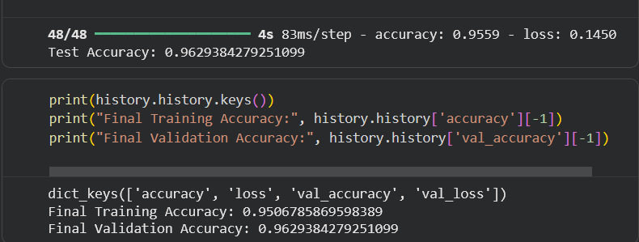
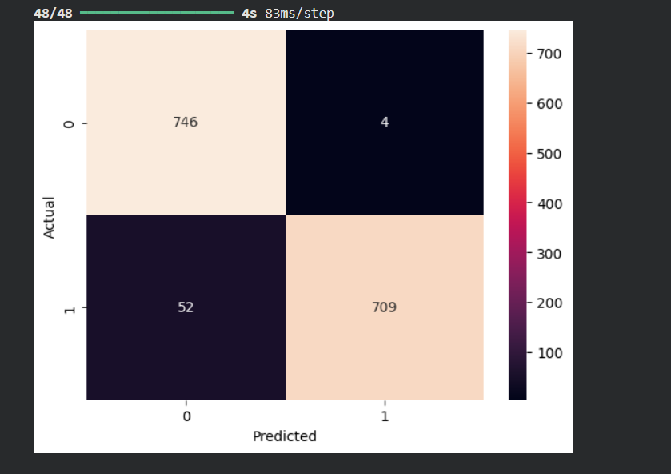
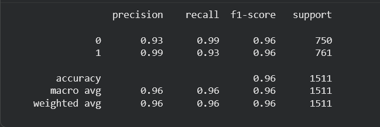

# Face Mask Detection using CNN

## 📌 Overview
This project implements a Convolutional Neural Network (CNN) to classify whether a person is wearing a face mask or not.

## 📊 Dataset
- Kaggle Face Mask Dataset
- Two classes:
  - 0 → Without Mask
  - 1 → With Mask

## 🧠 Model Architecture
- 3 Convolutional Layers (32, 64, 128 filters)
- MaxPooling Layers
- Fully Connected Dense Layers
- Dropout Regularization
- Sigmoid Output Layer

## 📈 Performance
- Test Accuracy: 96%
- Balanced Precision & Recall
- Confusion Matrix evaluation included

## 🚀 Technologies Used
- Python
- TensorFlow / Keras
- OpenCV
- NumPy
- Matplotlib
- Scikit-learn

## 🔍 Key Features
- Data Augmentation
- Binary Classification
- Confusion Matrix & Classification Report
- Model Saving (.h5)

## 📊 Model Performance

## 🔮 Future Improvements
- Real-time webcam detection
- Deployment using Streamlit or Flask
- Transfer Learning (MobileNetV2)
